# Part 1 answers
</br>

## <b>Made by Teemu Koivumaa<b>
### By clicking the exercise title, it takes you to the point in the repository where you can check the committed files for that exercise.

</br>

# [Exercise 1.01: Getting started](https://github.com/Teemukoivumaa/DevOps-with-Kubernetes/tree/884f59ccfaa682f2ff0e9a5b21af1f360e79801c)
Create an application that generates a random string on startup, stores this string into memory, and outputs it every 5 seconds with a timestamp. e.g.

<i>Forgot to add the timestamps at first but added them in the Exercise 1.7</i>

## Console output:
```
teemu@teemu-ideapad:~/Documents/Kubernetes$ kubectl logs random-strings-dep-5dbf4c86bb-7zql8

> randomStrings@1.0 start
> node index.js

717n2
sqnb1h
4kytli
qzdme
qvtby
teemu@teemu-ideapad:~/Documents/Kubernetes$
```

---

</br>

# [Exercise 1.02: Project v0.1](https://github.com/Teemukoivumaa/DevOps-with-Kubernetes/tree/e163d93dca14d9e7b373087419b646c28ebf254d)
Create a web server that outputs "Server started in port NNNN" when it is started and deploy it into your Kubernetes cluster.
## Console output:
```
teemu@teemu-ideapad:~/Documents/Kubernetes$ kubectl logs todo-app-64dcfffc46-77k9b

> TODO-app@0.1 start
> node server.js

Server started in port: 8080
```

---

</br>

# [Exercise 1.03: Declarative approach](https://github.com/Teemukoivumaa/DevOps-with-Kubernetes/tree/4a37c2988a536ea43672b29b6d68ca15669456b3)
In your "Log output" application create the folder for manifests and move your deployment into a declarative file.

## deployment.yaml
```yaml
apiVersion: apps/v1
kind: Deployment
metadata:
  name: random-strings-dep
spec:
  replicas: 1
  selector:
    matchLabels:
      app: random-strings
  template:
    metadata:
      labels:
        app: random-strings
    spec:
      containers:
        - name: random-strings
          image: teemukoivumaa/random-strings:latest
```

## Console output:
```
teemu@teemu-ideapad:~/Documents/Kubernetes/random-strings$ kubectl apply -f manifests/deployment.yaml
deployment.apps/random-strings-dep created
teemu@teemu-ideapad:~/Documents/Kubernetes/random-strings$ kubectl logs random-strings-dep-7d88fb5b4f-q9tdr

> randomStrings@1.0 start
> node index.js

qtzr2j
gsba
9gxtdk
zkmklj
s5w4x
xxhe1
u1w98
73p69
```
---

</br>

# [Exercise 1.04: Project v0.2](https://github.com/Teemukoivumaa/DevOps-with-Kubernetes/tree/0a2010db85770dbcfa87aa82a259ccffc47ef13a)
Create a deployment.yaml for the project.

## deployment.yaml
```yaml
apiVersion: apps/v1
kind: Deployment
metadata:
  name: todo-app-dep
spec:
  replicas: 1
  selector:
    matchLabels:
      app: todo-app
  template:
    metadata:
      labels:
        app: todo-app
    spec:
      containers:
        - name: todo-app
          image: teemukoivumaa/todo-app:latest
```

## Console output:
```
teemu@teemu-ideapad:~/Documents/Kubernetes/todo-app$ kubectl apply -f manifests/deployment.yaml
deployment.apps/todo-app-dep created
teemu@teemu-ideapad:~/Documents/Kubernetes/todo-app$ kubectl logs todo-app-dep-866f759595-m4tnh

> TODO-app@0.1 start
> node server.js

Server started in port: 8080
```

---

</br>

# [Exercise 1.05: Project v0.3](https://github.com/Teemukoivumaa/DevOps-with-Kubernetes/tree/7a1d0ad1669265b3bee3bb76c4e56efd6a14126c)
Have the project respond something to a GET request sent to the project. A simple html page is good or you can deploy something more complex like a single-page-application.

```
teemu@teemu-ideapad:~/Documents/Kubernetes/todo-app$ kubectl port-forward todo-app-dep-866f759595-vl4ss 3333:8080
Forwarding from 127.0.0.1:3333 -> 8080
Forwarding from [::1]:3333 -> 8080
Handling connection for 3333
```

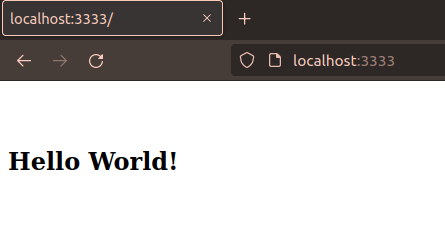

---

</br>

# [Exercise 1.06: Project v0.4](https://github.com/Teemukoivumaa/DevOps-with-Kubernetes/tree/be78a23ab1b4505adfdd37cc15340981ac1b637f)
Use a NodePort Service to enable access to the project.

## service.yaml
```yaml
apiVersion: v1
kind: Service
metadata:
  name: todo-app-svc
spec:
  type: NodePort
  selector:
    app: todo-app # This is the app as declared in the deployment.
  ports:
    - name: http
      nodePort: 30080 # This is the port that is available outside. Value for nodePort can be between 30000-32767
      protocol: TCP
      port: 1234 # This is a port that is available to the cluster, in this case it can be ~ anything
      targetPort: 8080 # This is the target port for the application
```

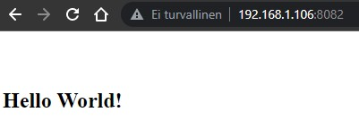
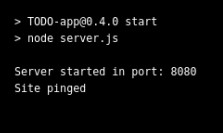

---

</br>

# [Exercise 1.07: External access with Ingress](https://github.com/Teemukoivumaa/DevOps-with-Kubernetes/tree/ac46b0cf7669b3df5632e4c335392e45638a0e6e)
Add an endpoint to request the current status (timestamp and string) and an ingress so that you can access it with a browser.

## ingress.yaml
```yaml
apiVersion: networking.k8s.io/v1
kind: Ingress
metadata:
  name: random-strings-ingress
spec:
  rules:
  - http:
      paths:
      - path: / # Path that forwards to the service
        pathType: Prefix
        backend:
          service:
            name: random-strings-svc # Service name
            port:
              number: 2345 # Port thats declared in service.yaml
```

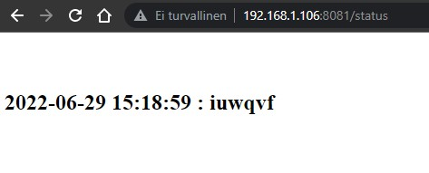
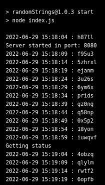

---

</br>

# [Exercise 1.08: Project v0.5](https://github.com/Teemukoivumaa/DevOps-with-Kubernetes/tree/54ed95db174975fe0db4e8106241c13d7f16a098)
Switch to using Ingress instead of NodePort to access the project.

## New service.yaml
```yaml
apiVersion: v1
kind: Service
metadata:
  name: todo-app-svc
spec:
  type: ClusterIP
  selector:
    app: todo-app
  ports:
    - port: 2345 # Ingress port
      protocol: TCP
      targetPort: 8080 # App port
```
## ingress.yaml
```yaml
apiVersion: networking.k8s.io/v1
kind: Ingress
metadata:
  name: todo-app-ingress
spec:
  rules:
  - http:
      paths:
      - path: /
        pathType: Prefix
        backend:
          service:
            name: todo-app-svc # Service name
            port:
              number: 2345 # Port thats declared in service.yam
```


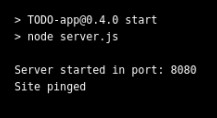

---

</br>

# [Exercise 1.09: More services](https://github.com/Teemukoivumaa/DevOps-with-Kubernetes/tree/167a782603148b3f0f3006c3ac72a80c3a4cae8e)
Develop a second application that simply responds with "pong 0" to a GET request and increases a counter (the 0) so that you can see how many requests have been sent. The counter should be in memory so it may reset at some point. Create a new deployment for it and have it share ingress with "Log output" application. Route requests directed '/pingpong' to it.

### Not really much to show here, all of the .yaml files are basicly the same expect the names changed inside them.


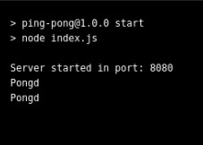

---

</br>

# [Exercise 1.10: Even more services](https://github.com/Teemukoivumaa/DevOps-with-Kubernetes/tree/1b219498d8827cbc7410a420135da0a720f01e05)
Split the "Log output" application into two different containers within a single pod:
- One generates a new timestamp every 5 seconds and saves it into a file.
- The other reads that file and outputs it with a hash for the user to see.

## deployment.yaml
```yaml
...
    spec:
      volumes: # Declare the volume
        - name: shared-log
          emptyDir: {} # Start with empty directory
      containers:
        - name: random-hasher
          image: teemukoivumaa/random-strings:1.0.4
          volumeMounts: # Declare the path where the shared log is stored
          - name: shared-log
            mountPath: /usr/src/app/files # Be sure that the paths are the same
        - name: timestamper
          image: teemukoivumaa/timestamper:1.0.0
          volumeMounts: # Declare the path where the shared log is stored
          - name: shared-log
            mountPath: /usr/src/app/files # Be sure that the paths are the same
```
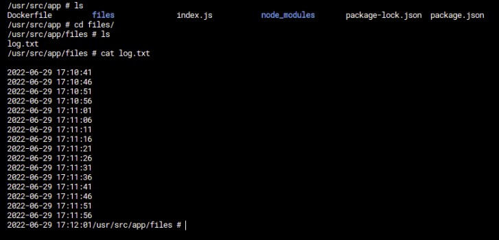

---

</br>

# [Exercise 1.11: Persisting data](https://github.com/Teemukoivumaa/DevOps-with-Kubernetes/commit/d50de8bc47b4dff338d8d5f7dd1d301ef6b62b2d)
Let's share data between "Ping-pong" and "Log output" applications using persistent volumes.

Save the number of requests to "Ping-pong" application into a file in the volume and output it with the timestamp and hash when sending a request to our "Log output" application.

</br>
<i>Will not show the persistent volume .yamls because they're basicly the same as in the examples.</i>

## deployment.yaml
```yaml
...
    spec:
      volumes:
        - name: shared-log
          persistentVolumeClaim: # Declare the volume claim
            claimName: random-strings-claim
      containers:
        - name: random-hasher
          image: teemukoivumaa/random-strings:1.0.5
          volumeMounts:
          - name: shared-log
            mountPath: /usr/src/app/files
        - name: timestamper
          image: teemukoivumaa/timestamper:1.0.0
          volumeMounts:
          - name: shared-log
            mountPath: /usr/src/app/files
        - name: ping-pong
          image: teemukoivumaa/ping-pong:1.1.2
          imagePullPolicy: "Always" # Added this because sometimes it didn't pull the new image
          volumeMounts:
          - name: shared-log
            mountPath: /usr/src/app/files
```

## ingress.yaml
```yaml
apiVersion: networking.k8s.io/v1
kind: Ingress
metadata:
  name: random-strings-ingress
spec:
  rules:
  - host: localhost # In the end I could have removed this because this only made things more hard
    http:
      paths:
      - path: /
        pathType: Prefix
        backend:
          service:
            name: random-strings-svc # Service name
            port:
              number: 2345 # Port thats declared in service.yaml
      - path: /pong # When accessing this, ingress directs the requests to the ping-pong service
        pathType: Prefix
        backend:
          service:
            name: ping-pong-svc # Service name
            port:
              number: 2346 # Port thats declared in service.yaml
```

## sevice.yaml
```yaml
apiVersion: v1
kind: Service
metadata:
  name: random-strings-svc
spec:
  type: ClusterIP
  selector:
    app: random-strings # Pod name
  ports:
    - port: 2345 # Ingress port
      protocol: TCP
      targetPort: 8080 # App port
--- # Love that you can declare more services in one file
    # You could declare everything in single file. deployment, ingress, services etc
apiVersion: v1
kind: Service
metadata:
  name: ping-pong-svc
spec:
  type: ClusterIP
  selector:
    app: random-strings # Pod name
  ports:
    - port: 2346 # Ingress port
      protocol: TCP
      targetPort: 8081 # App port
```

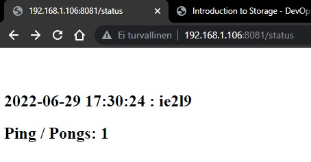
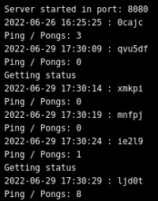
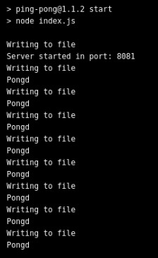

---

</br>

# [Exercise 1.12: Project v0.6](https://github.com/Teemukoivumaa/DevOps-with-Kubernetes/tree/124ea8817fee5d905cf13df51100b9275edbd26c)
The goal is to add a daily image to the project. And every day a new image is fetched on the first request.
- Find a way to store the image so it stays the same for an entire day
- Make sure to cache the image into a volume so that the API isn't needed for new images every time we access the application or the container crashes.

I implemented the daily photo by naming the photos in the format: "<i>YYYY-MM-DD.jpg</i>"-format. <b>Example:</b> 2022-06-29.jpg</br>

The program checks what day it is and based on that tries to find the picture
- If picture found -> Display that 
- Else download a new picture

## deployment.yaml
```yaml
spec:
      volumes:
        - name: shared-log
          persistentVolumeClaim: # Add persistent volume
            claimName: todo-app-claim
      containers:
        - name: todo-app
          image: teemukoivumaa/todo-app:0.6
          imagePullPolicy: Always
          volumeMounts:
          - name: shared-log
            mountPath: /usr/src/app/files
```


As the site is visited for the first time it downloads the picture. After that it just checks that it exists.
</br>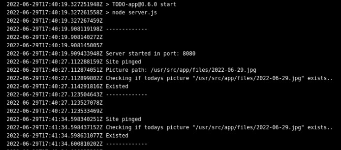

---

</br>

# [Exercise 1.13: Project v0.7](https://github.com/Teemukoivumaa/DevOps-with-Kubernetes/tree/af0e784e16cf0ec62e4feaa14387cc228505e433)
Style the page
1. Add an input field. The input should not take todos that are over 140 characters long.
2. Add a send button. It does not have to send the todo yet.
3. Add a list for the existing todos with some hardcoded todos.

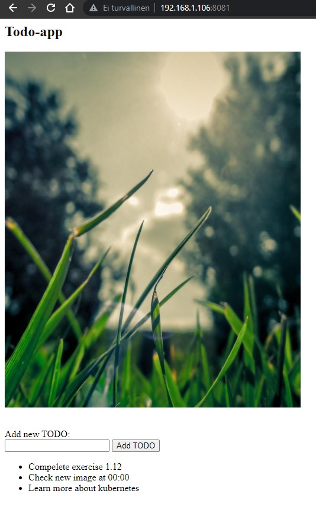

</br> 

# Diagrams for the applications

## ToDo-application


## Random strings && Pingpong
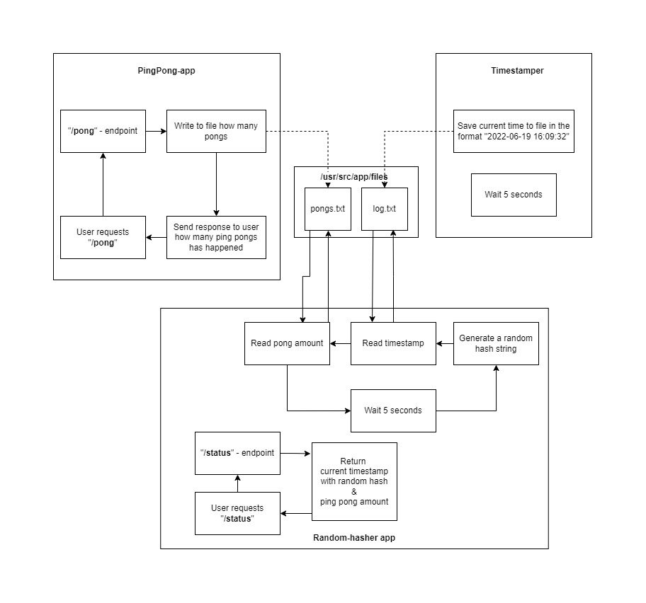
 