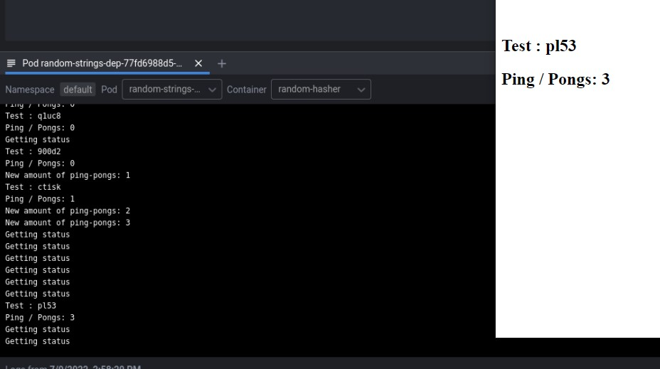
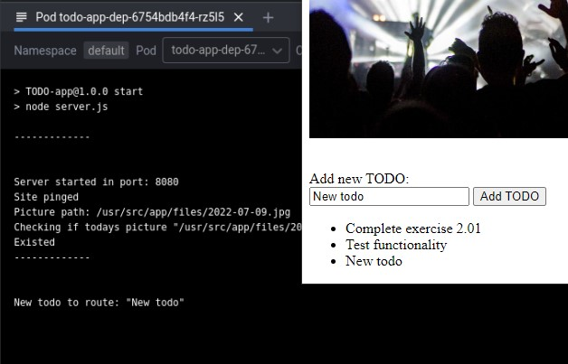
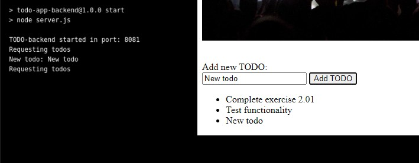
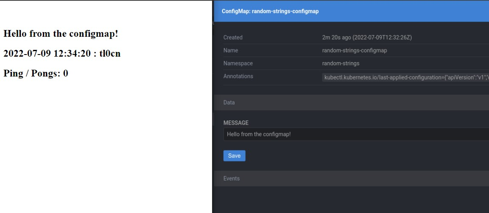
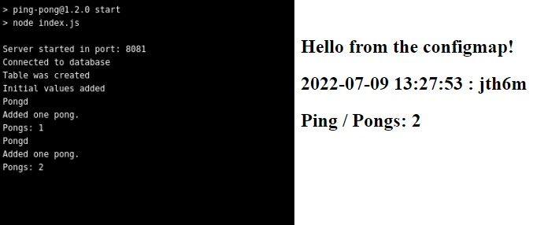
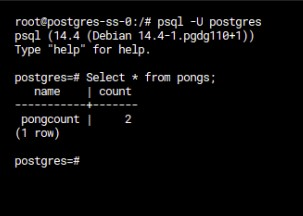
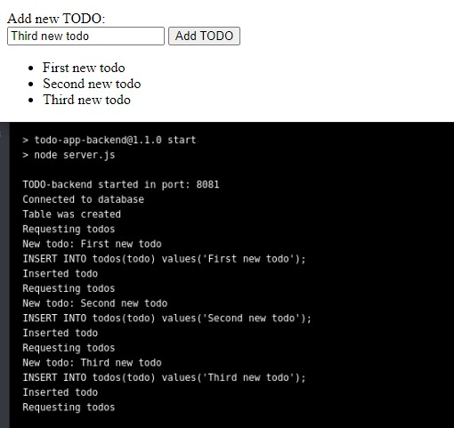
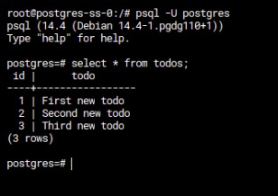
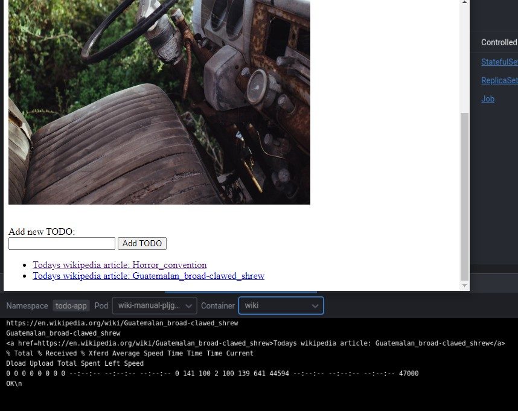
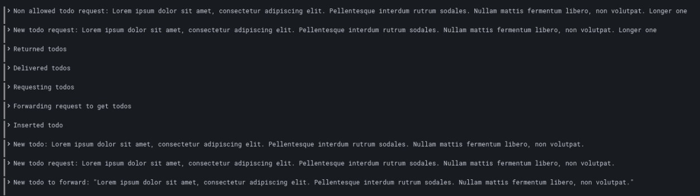

# Part 2 answers
</br>

## <b>Made by Teemu Koivumaa<b>
### By clicking the exercise title, it takes you to the point in the repository where you can check the committed files for that exercise.

</br>

# [Exercise 2.01: Connecting pods](https://github.com/Teemukoivumaa/DevOps-with-Kubernetes/tree/74b929dbafc05886d9fd21daebe9e58ac3435f14)
Connect the "Log output" application and "Ping-pong" application. Instead of sharing data via files use HTTP endpoints to respond with the number of pongs.


## Ping-pong application
```js
const sendPingPongs = () => {    
    axios.post('http://random-strings-svc:2345/pingPongs', { // Send the ping-pongs to the right place
       pingPongs: `${pongs}`
    })
    .then(function (response) { // Wait for OK reponse
        if (response.data != 'OK') console.log(response)
    })
    .catch(function (error) {
        console.log(error);
    });
}

app.get('/pong', function(req, res) {
    pongs += 1
    console.log("Pongd")

    res.send
        (
        ` 
        </br> </br>
        <h2>pong ${pongs}</h2>
        `
        )
    // When a new pong happens we want to send the new amount
    sendPingPongs()
})
```

## Random string application
```js
// File: index.js
// - - -
...
    app.use('/pingPongs', pingPongRouter); // Listen '/pingPongs'-address and move requests to the router
...
// - - - 

// File: pingPong.js
// Created a new separate route for the ping pongs

const express = require('express')
const router = express.Router();

var pingPongs = 0

router.post('/', (req, res) => { // This listens for new ping pong amount
    var newPings = req.body.pingPongs
    console.log(`New amount of ping-pongs: ${newPings}`)

    pingPongs = newPings ? newPings : pingPongs
    res.send('OK')
});

const returnPingPongs = () => { return pingPongs } // Returns the current ping-pong amount

module.exports = {
    router,
    returnPingPongs
};
```



</br>

---

</br>

# [Exercise 2.02: Project v1.0](https://github.com/Teemukoivumaa/DevOps-with-Kubernetes/tree/0457f0311f7b9e733647bf2f8d636e8c8e8e195b)

Create a new container for the backend of the todo application.

Use ingress routing to enable access to the backend.

Create
- POST /todos endpoint
- GET /todos endpoint 

In the new service where we can post a new todo and get all of the todos. You can also move the image logic to the new service if it requires backend logic.

The todos can be saved into memory, we'll add database later.

Frontend already has an input field. Connect it into our backend so that inputting data and pressing send will add a new todo into the list.

## Backend
```js
// File: server.js
// - - -
...
    // Routes we want to listen
    app.use('/todos', todoPOST)
    app.use('/todos', todoGET)
...
// File: todo.js
// - - -
var todos = ["Complete exercise 2.01", "Test functionality"]

const newTodos = router.post('/', (req, res) => {
    // Listen for new todos, check that they aren't null / empty
    var newTodo = req.body.todo
    if (!newTodo || newTodo.trim() == "") res.sendStatus(400)
    else {
        newTodo = newTodo.trim()
        console.log(`New todo: ${newTodo}`)
        todos.push(newTodo)
        res.sendStatus(200)
    }
})

const getTodos = router.get('/', (req, res) => {
    // Return the todos
    console.log('Requesting todos')

    res.send(JSON.stringify(todos))
})
```

## Frontend
```js
// File: index.js
// - - - 
// Browser js
async function getTodos() {
    const response = await fetch('/todos', {
        method: 'GET',
        mode: 'no-cors',
    })

    if (response.status == "200") {
        return response.json()
    }
}

async function addTodo(newTodo) {
    const response = await fetch('/newTodo', {
        method: 'POST',
        mode: 'cors',
        headers: {'Content-Type': 'application/json'},
        body: JSON.stringify({todo:`${newTodo}`})
    })

    if (response.status != "200") {
        console.log(response)
    } else createTodoList()
}
...
// File: server.js
// - - -
...
app.get('/todos', async function(req, res) {
    // Get the todos
    const response = await axios.get('http://todo-backend-svc:2346/todos')
    res.send(JSON.stringify(response.data))
})
...
app.use('/newTodo', todoRoute)
...
// File: todoRoute.js
// - - - 
const route = router.post('/', (req, res) => {
    // Route new todos fron browser to the backend
    let newTodo = req.body.todo
    console.log(`New todo to route: "${newTodo}"`)
    axios.post('http://todo-backend-svc:2346/todos', {
       todo: `${newTodo}`
    })
    .then(function (response) {
        if (response.status == 200) res.sendStatus(200)
        else console.log(response)
    })
    .catch(function (error) {
        console.log(error);
    });
})
```




---

</br>

# [Exercise 2.03: Keep them separated && Exercise 2.04: Project v1.1](https://github.com/Teemukoivumaa/DevOps-with-Kubernetes/tree/dbf5cbacfde68dd0cf9b14e483709bbc28b0ec3c)
Create a namespace for the applications in the exercises. Move the "Log output" and "Ping-pong" to that namespace and use that in the future for all of the exercises.

Created the namespaces with the command: ```kubectl create namespace example-namespace``` .

After that went around and tagged all the .yaml files with the correct namespace tags

## Example:
```yaml
metadata:
  namespace: random-strings
  name: random-strings-dep
```

</br>

---

</br>

# Exercise 2.05: Secrets
In all future exercises if you are using an API key or a password, such as a database password, you will use Secrets. You can use SOPS to store it to a git repository. Never save unencrypted files into a git repository.

No changes

Learned the hard way in the exercise 2.07 that the secret text *needs* to be in the base64 format.</br> But if you want to use strings you can also do that with the ```stringData```-field.

Example yamls are from the [kubernetes secret docs](https://kubernetes.io/docs/tasks/configmap-secret/managing-secret-using-config-file/)

## Base64 secret file
```yaml
apiVersion: v1
kind: Secret
metadata:
  name: mysecret
type: Opaque
data:
  username: YWRtaW4=
  password: MWYyZDFlMmU2N2Rm
```

## String secret file
```yaml
apiVersion: v1
kind: Secret
metadata:
  name: mysecret
type: Opaque
stringData:
  config.yaml: |
    apiUrl: "https://my.api.com/api/v1"
    username: <user>
    password: <password>  
```

## Both

```yaml
apiVersion: v1
kind: Secret
metadata:
  name: mysecret
type: Opaque
data:
  username: YWRtaW4=
stringData:
  username: administrator
```

</br>

# [Exercise 2.06: Documentation and ConfigMaps](https://github.com/Teemukoivumaa/DevOps-with-Kubernetes/tree/3330812d6b3935f390240365854db0be1cd662b0)
Create a ConfigMap for a "dotenv file". A file where you define environment variables that are loaded by the application. For this use an environment variable "MESSAGE" with value "Hello" to test and print the value.

## configmap.yaml
```yaml
apiVersion: v1
kind: ConfigMap
metadata:
  namespace: random-strings
  name: random-strings-configmap
data:
  MESSAGE: "Hello from the configmap!"
```

## deployment.yaml
```yaml
containers:
        - name: random-hasher
          image: teemukoivumaa/random-strings:1.0.7
          env:  # Define the environment variable
            - name: MESSAGE # Notice that the case is different here
              valueFrom:
                configMapKeyRef:
                  name: random-strings-configmap # The ConfigMap this value comes from.
                  key: MESSAGE  # The key to fetch.
```

## Frontend app
```js
app.get('/', function(req, res) {
    console.log("Getting status");
    // Env variable is read here
    res.send
        (
        `
        </br> </br>
        <h2>${process.env.MESSAGE}</h2>
        <h2>${timestampedText}</h2>
        <h2>${pingpongText}</h2>
        `
        )
});
```



---

</br>

# [Exercise 2.07: Stateful applications](https://github.com/Teemukoivumaa/DevOps-with-Kubernetes/tree/bdf533b144992f9520166726b4217038a60d7c71)
Run a postgres database and save the Ping-pong application counter into the database.

The postgres database and Ping-pong application should not be in the same pod. A single postgres database is enough and it may disappear with the cluster but it should survive even if all pods are taken down.

You should not write the database password in plain text.

## statefulset.yaml
```yaml
...
containers:
        - name: postgres
          image: postgres:latest
          ports:
            - name: postgres
              containerPort: 5432
          volumeMounts:
            - name: data
              mountPath: /data 
          env:
            - name: POSTGRES_USER
              value: "postgres"
          envFrom:
            - secretRef:
                name: dbpass
...
```

## deployment.yaml
```yaml
containers:
- name: ping-pong
          image: teemukoivumaa/ping-pong:1.2.0
          imagePullPolicy: "Always"
          env:
            - name: PINGPONGPORT
              valueFrom:
                configMapKeyRef:
                  name: random-strings-configmap
                  key: PINGPONGPORT
          envFrom:
            - secretRef: 
                name: dbpass # Getting the database password from the secrets file
```

## ping-pong app
```js
const password = process.env.POSTGRES_PASSWORD.toString() // Get the database password
const { Client } = require('pg');
const client = new Client({
    host: 'postgres-svc',
    user: 'postgres',
    database: 'postgres',
    password: password,
    port: 5432
});

// Some queries to:
// - create the table
// - insert initial values
// - get the pong count
// - update the pong count

const createTableQuery = `
    CREATE TABLE IF NOT EXISTS "pongs" (
        name VARCHAR(30) NOT NULL,
        count INT NOT NULL,
        PRIMARY KEY (name)
    );`
const initialValue = "INSERT INTO pongs (name, count) VALUES('pongcount', 0) ON CONFLICT DO NOTHING"
const countQuery = "SELECT count FROM pongs WHERE name = 'pongcount';"
const updateQuery = "UPDATE pongs SET count = count + 1 WHERE name = 'pongcount';"
...
const updateDB = () => {
    client.query(updateQuery, (error, response) => {
        if (error) throw error.stack;
        console.log("Added one pong.")
    });
}
...
app.get('/pong', function(req, res) {
    console.log("Pongd")
    updateDB()

    client.query(countQuery, (error, response) => {
        if (error) throw error.stack
        console.log("Pongs:", response.rows[0].count)
        var pongs = response.rows[0].count
        res.send(
            `
            </br> </br>
            <h2>pong ${pongs}</h2>
            `)
        sendPingPongs(pongs)
    })
})
```




---

</br>

# [Exercise 2.08: Project v1.2](https://github.com/Teemukoivumaa/DevOps-with-Kubernetes/tree/c80563b33786812297a911dd079c1fc6214ea650)
Create a database and save the todos there.

Use Secrets and/or ConfigMaps to have the backend access the database.

For the most part the code stayed the same, only needed to modify the reading and writing of todos.

## Backend
```js
const addTodo = (todo) => {
    const insertQuery = `INSERT INTO todos(todo) values('${todo}');`
    console.log(insertQuery)
    if (!queryDB(insertQuery)) {
        console.log("Failed to insert new todo")
    } else console.log("Inserted todo")
}

const getTodos = router.get('/', async function(req, res) {
    console.log('Requesting todos')
    await fetchTodos(res)
})

const fetchTodos = (res) => {
    const getQuery = "SELECT * FROM todos;"
    client.query(getQuery, (error, response) => {
        if (error) throw error.stack
        const rows = response.rowCount // Get how many rows of ToDo's there is
        var todos = []

        for (var i = 0; i < rows; i++) { // Loop trough the ToDo's & add them to an array
            todos.push(response.rows[i].todo)
        }

        res.send(JSON.stringify(todos)) // Send the ToDo-array as JSON
    })
}
```




---

</br>

# [Exercise 2.09: Daily todos](https://github.com/Teemukoivumaa/DevOps-with-Kubernetes/tree/5c4d01f021d9640354c160f319adc864d80f9770)
Create a CronJob that generates a new todo every day to remind you to do 'Read < URL >'.

Where < URL > is a wikipedia article that was decided by the job randomly. It does not have to be a hyperlink, the user can copy paste the url from the todo.

## cronjob.yaml
```yaml
apiVersion: batch/v1
kind: CronJob
metadata:
  namespace: todo-app
  name: wiki
spec:
  schedule: "0 0 * * *" # Run at midnight everyday, could be replaced with @daily
  jobTemplate:
    spec:
      template:
        spec:
          containers:
          - name: wiki
            image: teemukoivumaa/wiki:1.1
          restartPolicy: Never
```

## Cronjob that get's the random wikipedia articles
```sh
#!/bin/sh

# -s = Silent 
# -L = Follow redirect
# -I = Fetch the headers only
# -o = Output to /dev/null == don't output anywhere
# -w = Format

URL=$(curl http://en.wikipedia.org/wiki/Special:Random -s -L -I -o /dev/null -w '%{url_effective}')

echo "$URL"
TEXT=$(echo $URL | rev | cut -d '/' -f 1 | rev)
echo "$TEXT"

LINKURL="<a href="$URL">Todays wikipedia article: $TEXT</a>"

echo "$LINKURL"

curl -X POST http://todo-backend-svc:2346/todos -H "Content-Type: application/json" -d '{"todo": "'"$LINKURL"'"}'

echo "\n"
```




</br>

---

</br>

# [Exercise 2.10: Project v1.3](https://github.com/Teemukoivumaa/DevOps-with-Kubernetes/tree/8f53c406db64cc3a7b4c517133f54faef2b07fff)
The project could really use logging.

Add request logging so that you can monitor every todo that is sent to the backend.

Set the limit of 140 characters for todos into the backend as well. Use Postman or curl to test that too long todos are blocked by the backend and you can see the non-allowed messages in your grafana.

## Ping pong
```js
...
// Added the 140 char limit
if (!newTodo || newTodo.trim() == ""|| newTodo.length > 140) {
        console.log(`Non allowed todo request: ${newTodo}`)
        res.sendStatus(400) 
}
...
```



 