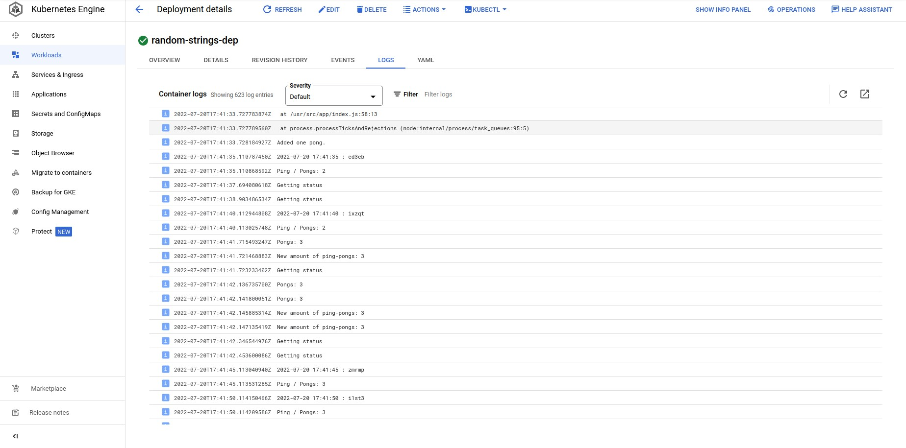
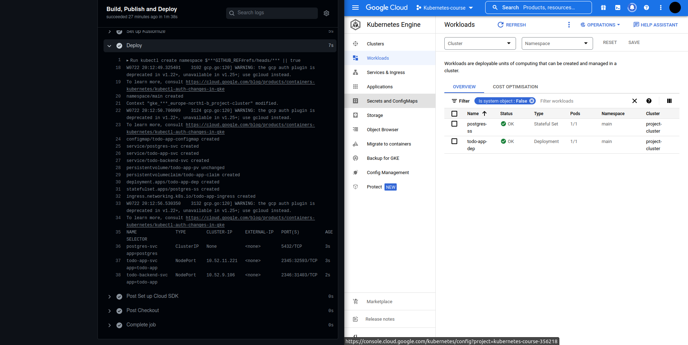
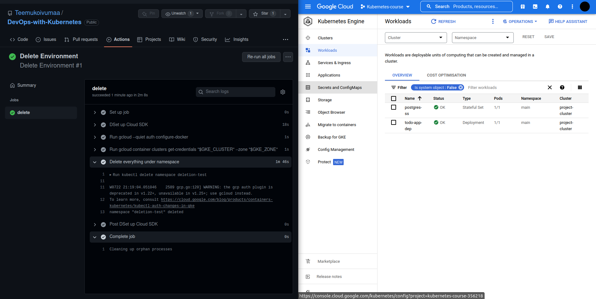
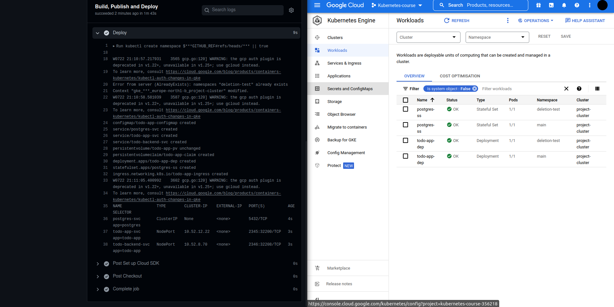
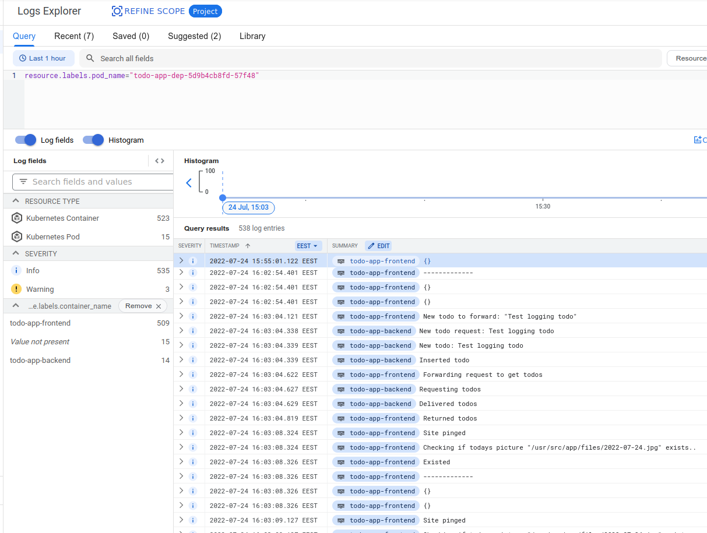

# Part 1 answers
</br>

## <b>Made by Teemu Koivumaa<b>
### By clicking the exercise title, it takes you to the point in the repository where you can check the committed files for that exercise.

</br>

https://github.com/Teemukoivumaa/DevOps-with-Kubernetes/tree/9bad6f2060946ab13bc7d304fb936ca952594689

# [Exercise 3.01: Pingpong GKE](https://github.com/Teemukoivumaa/DevOps-with-Kubernetes/tree/9bad6f2060946ab13bc7d304fb936ca952594689)
Deploy ping / pong application into GKE.

Deploying to Google Cloud Engine was really easy. Only needed to specify that one service is a LoadBalancer and needed to add one line to the kubernetes StatefulSet.

</br>

### postgres-statefulset.yaml
```yaml
...
    spec:
      containers:
        - name: postgres
          image: postgres:latest
          ports:
            - name: postgres
              containerPort: 5432
          volumeMounts:
            - name: postgresql-db-disk
              mountPath: /data
              subPath: postgres # <-- Added this line to make StatefulSet work in GKE
...
```

</br>

### service.yaml
```yaml
apiVersion: v1
kind: Service
metadata:
  namespace: random-strings
  name: random-strings-svc
spec:
  type: LoadBalancer # Changed from ClusterIP --> LoadBalancer
  selector:
    app: random-strings
  ports:
    - port: 2345
      protocol: TCP
      targetPort: 8080
      name: random-strings
```




# [Exercise 3.02: Back to Ingress](https://github.com/Teemukoivumaa/DevOps-with-Kubernetes/tree/31833d3f4064a6c73111eece793b0ed8e0a07e99)

Deploy the "Log output" and "Ping-pong" applications into GKE and expose it with Ingress.

Kinda did this already in the Exe3.01. Only needed to specify that the services are NodePorts instead on LoadBalancer and ClusterIP

### service.yaml
```yaml
apiVersion: v1
kind: Service
metadata:
  namespace: random-strings
  name: random-strings-svc
spec:
  type: NodePort # <-- was LoadBalancer
  selector:
    app: random-strings
  ports:
    - port: 2345
      protocol: TCP
      targetPort: 8080
      name: random-strings
---
apiVersion: v1
kind: Service
metadata:
  namespace: random-strings
  name: ping-pong-svc
spec:
  type: NodePort # <-- was ClusterIP
  selector:
    app: random-strings
  ports:
```

# [Exercise 3.03: Project v1.4](https://github.com/Teemukoivumaa/DevOps-with-Kubernetes/tree/8cf05160aa29e0034779c4fa6cbfef276b3c375b)

Setup automatic deployment for the project as well.

Created GitHub actions to automatically deploy the todo project to GKE. Added kustomization.yaml that made deploying and also testing changes really easy.

[Github actions succesful run](https://github.com/Teemukoivumaa/DevOps-with-Kubernetes/runs/7473388456?check_suite_focus=true)

### kustomization.yaml
```yaml
apiVersion: kustomize.config.k8s.io/v1beta1
kind: Kustomization
resources:
  - ./manifests/deployment.yaml
  - ./manifests/service.yaml 
  - ./manifests/ingress.yaml
  - ./manifests/configmap.yaml
  - ./manifests/postgres-statefulset.yaml
  - ./manifests/persistentvolume.yaml
  - ./manifests/persistentvolumeclaim.yaml
```

# [Exercise 3.04: Project v1.4.1](https://github.com/Teemukoivumaa/DevOps-with-Kubernetes/tree/)

Improve the deployment so that each branch creates its own environment.

Made so that the pipeline automatically creates the namespace and set's that to the current namespace

### workflows/main.yml
```yaml
...
    - name: Deploy
        run: |-
          kubectl create namespace ${GITHUB_REF#refs/heads/} || true  # Create the namespace for the branch
          kubectl config set-context --current --namespace=${GITHUB_REF#refs/heads/} # Set the current namespace for context
          kubectl apply -k ./todo-app/
          kubectl get services -o wide
```



# [Exercise 3.05: Project v1.4.2](https://github.com/Teemukoivumaa/DevOps-with-Kubernetes/tree/e5d8e9f9497c321e35e5cc3f87ea130c98b426d0)

Finally, create a new workflow so that deleting a branch deletes the environment.

Created pipeline to delete the enviroment when the branch is deleted

### workflows/delete.yml
```yaml
name: Delete Environment

on:
  delete:
    branches-ignore:
      - main
      - master

env:
  GKE_CLUSTER: project-cluster
  GKE_ZONE: europe-north1-b

jobs:
  delete:
    runs-on: ubuntu-latest
    steps:
      - name: DSet up Cloud SDK
        uses: 'google-github-actions/setup-gcloud@main'
        with:
          project_id: ${{ secrets.GKE_PROJECT }}
          service_account_key: ${{ secrets.GKE_SA_KEY }}
          export_default_credentials: true
      - run: gcloud --quiet auth configure-docker
      - run: gcloud container clusters get-credentials "$GKE_CLUSTER" --zone "$GKE_ZONE"

      - name: Delete everything under namespace
        run: kubectl delete namespace ${{ github.event.ref }}
```





# [Exercise 3.06 DBaaS vs DIY](https://github.com/Teemukoivumaa/DevOps-with-Kubernetes/tree/407d5a3c47812fac914e16406c208c7e5e064ab2)

## DBaaS

### Pros
- Easy to setup and work with
- Effort to maintain it is minimal
- Customer support that can and will help with your problems and questions
- Reliablity
    - Is maintained and developed by group of specialists
    - Standards of the data centers are higher, so that usually leads to less downtime and errors in the servers.
    - Easy to setup backup schedule and backup storage
- Usually more cheap than making your own custom solution
    - Don't need to hire people to maintain it
    - Don't need your own machines to run it & pay for the electricity costs
    - Don't need to buy the software licenses (if you need to use a paid software solution)
### Cons
- You only control the data and the aplication
- If the databases are located far away, that might increase loading times
- Testing with sensitive data is not suitable
- Data protection and compliance guidelines depend on the location of the data center
- If the database servers go down, you can't do anything to fix them and will need to wait.

## DIY

### Pros
- You can specify your needs and make a solution that supports them
- Control the machines and maybe even run some other software on them
- Control of the database design and planning, configuration, integration, staffing, and maintenance

### Cons
- You need to upgrade and maintain the services and machines -> Complexity
- Cost of development time. Developers are busy making and maintaining the machines instead of developing the software that you will sell.
- As your organization grows, so will the cost and complexity of your database and its integration to other parts of the organization
- Can have unexpected costs


# [Exercise 3.07: Commitment](https://github.com/Teemukoivumaa/DevOps-with-Kubernetes/tree/697d5ebc18a2ed1f74a9a376bcd2dc68b6b59f76)
I chose to use the Postgres with PersistentVolumeClaim approach instead of using Google Cloud SQL.

I just tought that using Postgres and making the PVC is more fun. Also having just spend a lot of time debugging why the PVC & PV where I store the daily pictures wasn't working, I was really familiar on how to make them work in GKE. Altough it would kind of make more sense to learn a bit about GCSQL to familiarise myself a bit more on using DBaaS myself. Also I could have skipped all of this debugging by just using the GCSQL.

### persistentvolumeclaim.yaml
```yaml
apiVersion: v1
kind: PersistentVolumeClaim
metadata:
  name: db-claim
spec:
  storageClassName: standard
  accessModes:
    - ReadWriteOnce
  resources:
    requests:
      storage: 10Gi
```

# [Exercise 3.08: Project v1.5](https://github.com/Teemukoivumaa/DevOps-with-Kubernetes/tree/dab80e78a75bcdeb07529779cafae71f25f6df1c)

Set sensible resource limits for the project. The exact values are not important. Test what works.

Created the horizontal pod autoscaler and set the resource limits. The resource limits were more than enough for the apps, but maybe reserve too much resources than not enough.

### deployment.yaml
```yaml
...
    containers:
        - name: todo-app-frontend
          image: teemukoivumaa/todo-app:1.0.1
          imagePullPolicy: Always
          resources:
            limits:
              cpu: "150m"
              memory: "150Mi"
          volumeMounts:
          - name: shared-log
            mountPath: /usr/src/app/files
        ...
        - name: todo-app-backend
          image: teemukoivumaa/todo-backend:1.1.1
          imagePullPolicy: Always
          resources:
            limits:
              cpu: "200m"
              memory: "150Mi"
...
```

### horizontalpodautoscaler.yaml
```yaml
apiVersion: autoscaling/v1
kind: HorizontalPodAutoscaler
metadata:
  name: todo-app-hpa
spec:
  scaleTargetRef:
    apiVersion: apps/v1
    kind: Deployment
    name: todo-app-dep
  minReplicas: 1
  maxReplicas: 6
  targetCPUUtilizationPercentage: 50 
```

# [Exercise 3.09: Resource limits](https://github.com/Teemukoivumaa/DevOps-with-Kubernetes/tree/4dcc52e1fd0a7adf0e2bfc2946073c2e70a048ae)

Set sensible resource limits for the "Ping-pong" and "Log output" applications. The exact values are not important. Test what works.

Set almost the same resource limits as in the last exercise:
- cpu: "100m"
- memory: "150Mi"

# [Exercise 3.10: Project v1.6](https://github.com/Teemukoivumaa/DevOps-with-Kubernetes/tree/)

Read documentation for Kubernetes Engine Monitoring here and setup logging for the project in GKE.

Submit a picture of the logs when a new todo is created.



