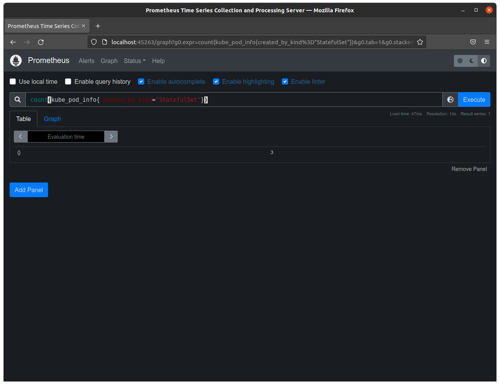
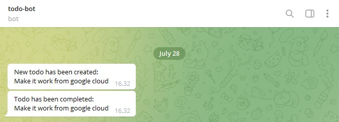

# Part 4 answers
</br>

## <b>Made by Teemu Koivumaa<b>
### By clicking the exercise title, it takes you to the point in the repository where you can check the committed files for that exercise.

</br>

# [Exercise 4.01](https://github.com/Teemukoivumaa/DevOps-with-Kubernetes/tree/415d0ef49d720901fc18e1b7a27c0fc7dffb5019)
Create a ReadinessProbe for "Ping-pong" application. It should be ready when it has a connection to database.
And another ReadinessProbe for "Log output" application. It should be ready when it can receive data from "Ping-pong" application.

Initially I had a lot of troube with the pods not being able to communicate with each other. I finally after many hours fixed it with moving the app's to their own deployments. After that the exercise was really easy & straight forward.

The readiness probe in ping-pong waited 30secs before starting to try and connect to the database.
In random-strings I could have put the initial delay a 10secs longer because sometimes it fails in the first time.

### pingpong-deployment.yaml
```yaml
...
    spec:
      containers:
        - name: ping-pong
          image: teemukoivumaa/ping-pong:1.3.0
          imagePullPolicy: "Always"
          readinessProbe:
            initialDelaySeconds: 30
            periodSeconds: 5
            httpGet:
              path: /check
              port: 8081
...
```

### randomstrings-deployment.yaml
```yaml
...
    containers:
        - name: random-strings
          image: teemukoivumaa/random-strings:1.2.1
          imagePullPolicy: "Always"
          readinessProbe:
            initialDelaySeconds: 40
            periodSeconds: 5
            httpGet:
              path: /healthz
              port: 8080
...
```

# [Exercise 4.02](https://github.com/Teemukoivumaa/DevOps-with-Kubernetes/tree/088aa376cb1d8fa953357b7f5a6bd1edd63a9d46)
Create the required Probes and endpoint for the project to ensure that it's working and connected to a database.

Nothing to show here really as it's basically done the same as above. This exercise went really smoothly now that I knew I needed to separete the app deployments for some reason. 

# [Exercise 4.03](https://github.com/Teemukoivumaa/DevOps-with-Kubernetes/tree/)
Write a query that shows the number of pods created by StatefulSets in "prometheus" namespace.


# [Exercise 4.04](https://github.com/Teemukoivumaa/DevOps-with-Kubernetes/tree/)
Create an AnalysisTemplate for the project that will follow the cpu usage of all containers in the namespace.

Added analysis template

### analysis.yaml
```yaml
apiVersion: argoproj.io/v1alpha1
kind: AnalysisTemplate
metadata:
  name: cpu-usage-rate
spec:
  metrics:
  - name: cpu-usage
    interval: 15s
    successCondition: result < 0.5
    provider:
      prometheus:
        address: http://kube-prometheus-stack-1658-prometheus.prometheus.svc:9090
        query: |
          scalar(
            sum(rate(node_cpu_seconds_total{mode!="idle", namespace="master"}[5m]))/sum(machine_cpu_cores)
          )*100
```

# [Exercise 4.05](https://github.com/Teemukoivumaa/DevOps-with-Kubernetes/tree/)
Speaking of updating. Our todo application could use "Done" field for todos that are already done. It should be a PUT request to /todos/<id>.

This was really fun to do. In the database added one more row for the todo's. If it wasn't done the value is "0" and when done it's "1". Based on that it's really easy to search done and incomplete todos.

</br>

Snipped of the PUT request:
### frontend/server.js
```js
...
app.post('/updateTodo', async function(req, res) {
    console.log("Forwarding request to mark todo as done")

    var todoID = req.body.todoID
    if (todoID && todoID != null) {
        const response = await axios.put(`http://todo-backend-svc:2346/todos/${todoID}`)
        res.status(200)
        res.send("OK")
        console.log("Returning")
    } else {
        res.status(500)
        res.send("NOT OK")
    }
})
...
```

### backend/todo.js
```js
...
const updateTodo = router.put('/:todoID', function (req, res) {
    var todoID = req.params.todoID
    console.log(`Todo id: ${todoID}`)
    const updateQuery = `UPDATE todos SET done = 1 WHERE id=${todoID}`
    if (!queryDB(updateQuery)) {
        console.log("Failed to update todo")
        res.status(500)
        res.send("Fail")
    } else { 
        console.log("Updated todo to done") 
        res.status(200)
        res.send("OK")
    }
})
...
```

</br>

Also made this little smart bash script that generates and pushes the docker image automatically:
### docker_build.sh
```sh
#!/bin/bash

# Get project version from the package.json
VERSION=$(npx -c 'echo "$npm_package_version"')
echo "$VERSION"

# With the version we can build the docker image and push it
docker build . -t teemukoivumaa/todo-app:$VERSION && docker push teemukoivumaa/todo-app:$VERSION
```

# [Exercise 4.06](https://github.com/Teemukoivumaa/DevOps-with-Kubernetes/tree/29946340bf8933439046ee19650cecc7cbe9c853)
Create a new separate service for sending status messages of the todos to a popular chat application. Let's call the new service "broadcaster".

This exercise was the most interesting and one that I really wanted to do. Unfortunately NATS didn't want to work like it didn't for some other people on the discord side also. Still I just used normal requests to deliver newly created tasks and completed tasks to broadcaster that send that info the me with Telegram.

The broadcaster app had express server running and listened to POST-requests coming to "http://todo-broadcaster-svc:2347/update"



### broadcaster/server.js
```js
...
function postTelegram(message) {
    console.log("Posting to telegram:", message)

    var url = `https://api.telegram.org/bot${botToken}/sendMessage`
    axios.post(url, {
        chat_id: process.env.TELEGRAM_ID.toString(),
        text: message
    })
    .then(function (response) {
        if (response.statusCode == "200") console.log("OK")
    })
    .catch(function (error) {
        console.log(error);
    })
}
...
```

# [Exercise 4.07](https://github.com/Teemukoivumaa/dwk-git-ops)
Move your cluster configuration to GitOps.

Made a new repository ([dwk-git-ops repository](https://github.com/Teemukoivumaa/dwk-git-ops)) were I will be doing this and the next exercise.

Updates to the yaml files update the deployments to the cluster and they run fine

# [Exercise 4.08](https://github.com/Teemukoivumaa/dwk-git-ops)
Move your project to use GitOps so that you can develop to the repository and the application is automatically updated even locally!

Made the project.yaml for the project artifacts

```yaml
apiVersion: source.toolkit.fluxcd.io/v1beta1
kind: GitRepository
metadata:
  name: kube-repo
  namespace: flux-system
spec:
  interval: 1m
  url: https://github.com/teemukoivumaa/DevOps-with-Kubernetes
  ref:
    branch: main
---
apiVersion: kustomize.toolkit.fluxcd.io/v1beta1
kind: Kustomization
metadata:
  name: todo-app
  namespace: flux-system
spec:
  sourceRef:
    kind: GitRepository
    name: kube-repo
  interval: 1m
  path: ./todo-app
  prune: true
  validation: client
```
