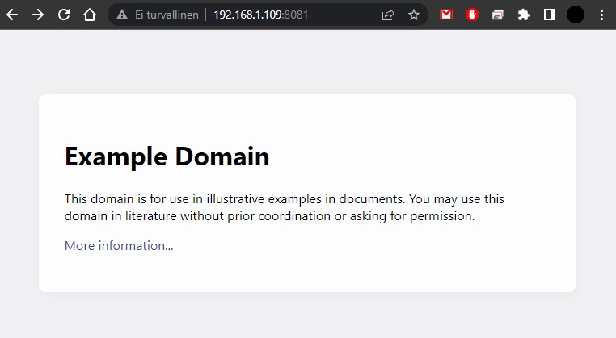
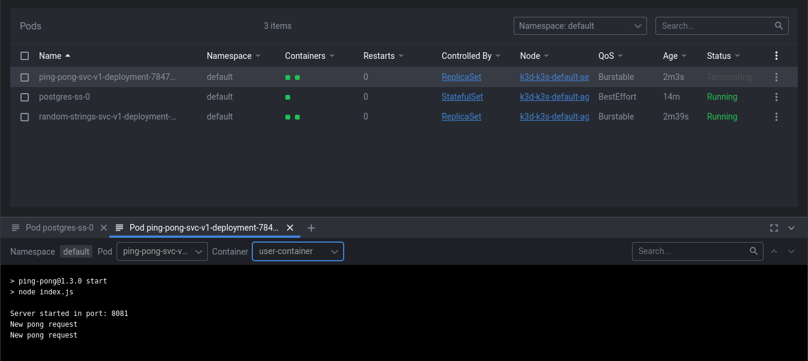
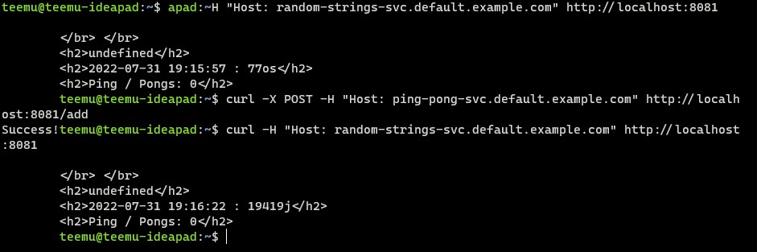

# Part 5 answers
</br>

## <b>Made by Teemu Koivumaa<b>
### By clicking the exercise title, it takes you to the point in the repository where you can check the committed files for that exercise.

</br>

# [Exercise 5.01: DIY CRD & Controller](https://github.com/Teemukoivumaa/DevOps-with-Kubernetes/tree/56acd5d487b1b84002acdc760521f7b23e316c60)

Create a project that creates a copy of a website when new "DummySite"-resource is created, and it contains string property called "website_url".

Creating this project was really fun and showed what you could do with custom resources. I chose to do the app with JS because that's what I have been using the whole course.



</br>

Getting the URL from the resource:
### index.js
```js
...
watch.watch('/apis/stable.dwk/v1/dummysites',
    // optional query parameters can go here.
    {
        allowWatchBookmarks: true,
    },
    // callback is called for each received object.
    (type, apiObj, watchObj) => {
        if (type === 'ADDED') {
            const url = apiObj.spec.website_url
            console.log(url)

            if (!url) {
                console.log("No url")
                return
            }

            geturl(url)
        } else if (type === 'MODIFIED') {
            console.log('changed object:')
        } else if (type === 'DELETED') {
            console.log('deleted object:')
        } else if (type === 'BOOKMARK') {
            console.log(`bookmark: ${watchObj.metadata.resourceVersion}`)
        } else {
            console.log('unknown type: ' + type)
        }
        console.log(apiObj)
    },
    (err) => {
        console.log("Error in watch")
        console.log(err)
    })
.then((req) => {
    // watch returns a request object which you can use to abort the watch.
    console.log("Setting timeout for abort")
    setTimeout(() => { req.abort() }, 100 * 1000);
})
...
```

### dummysite.yaml
```yaml
apiVersion: stable.dwk/v1
kind: DummySite
metadata:
  name: dummyresource
spec:
  website_url: https://example.com/
```

# [Exercise 5.02: Project: Service Mesh Edition](https://github.com/Teemukoivumaa/DevOps-with-Kubernetes/tree/e1be439d569a2515fb80dc9de4f5de3bf4787dd4)

Add the modified manifests (through linkerd inject) to the repository for submission.

Deployment are manifests here: https://github.com/Teemukoivumaa/DevOps-with-Kubernetes/tree/main/Part5/Exe5.02

# [Exercise 5.03: Learn from external material](https://github.com/Teemukoivumaa/DevOps-with-Kubernetes/tree/main/Part5/Exe5.03)

I used the script command to get the output from the commands.

The (cleaned) log file: https://github.com/Teemukoivumaa/DevOps-with-Kubernetes/blob/main/Part5/Exe5.03/log.txt

# Exercise 5.04: Platform comparison

I chose Rancher because I have used it before:
- It's open source
- Is the market leader in open source native Kubernetes management
- Installation of Rancher is very easy and quick, all you need is to have Docker installed
- They offer free online meetups to learn how to use Rancher to easily deploy and manage Kubernetes
- It supports tools that DevOps teams use: Jenkins, Gitlab or Travis
- It allows you to manage any cluster and multiple clusters, not just Rancher created clusters

# [Exercise 5.05: Deploy to Serverless](https://github.com/Teemukoivumaa/DevOps-with-Kubernetes/tree/38b572ca35a426208857fa590989c6e97100d28e)
Let's test serverless by making the Ping-pong application serverless.

This was also really cool exercise to do. First had some trouble with the knative not wanting to install but thanks to google got that figured out. 

Creating the serverless knative-services was really easy and they worked on the first try. Didn't really understand how I could convert the prostgres statefulset to knative service, so I just ran that as is. The second problem was trying to connect between knative services. 

For some reason when I'm sending the new amount of ping-pong's to the random-strings app it doesn't call it even tough I use the "random-strings-svc.default.example.com" that it should have access to.

When pinging the applications from the command line they both responded tough so I take that as a win.




### serverless.yaml
```yaml
apiVersion: serving.knative.dev/v1
kind: Service
metadata:
  name: random-strings-svc
spec:
  template:
    metadata:
      name: random-strings-svc-v1
    spec:
      containers:
        - image: teemukoivumaa/random-strings:1.2.1
          ports:
            - containerPort: 8080
---
apiVersion: serving.knative.dev/v1
kind: Service
metadata:
  name: ping-pong-svc
spec:
  template:
    metadata:
      name: ping-pong-svc-v1
    spec:
      containers:
        - image: teemukoivumaa/ping-pong:1.3.0
          ports:
            - containerPort: 8081
          envFrom:
            - secretRef:
                name: dbpass
```

# Exercise 5.06: Landscape


### Database
- MySQL: Used outside of the course
- PostgresSQL: Used as a database solution in exercises
- redis: Used outside of the course
- MongoDB: Used outside of the course

### Streaming & Messaging
- NATS: Tried using this in the part 4 of the course

### Application Definition & Image Build
- Helm: During the course helm was used to download different applications to use in other 
- Gradle: Works on the background of java & other projects I have developed myself outside of the course

### Continuous Integration & Delivery
- Argo: Used Argo Rollouts for canary releases in part 4
- Flux: Used to GitOpsify the application cluster in part 4
- GitHub actions: Used to set up automation for the deployment to Google Cloud Engine through GitHub during the course
- Jenkins: Used outside of the course
- GitLab: Used outside of the course

### Platform
- AWS: Used outside of the course
- Microsof Azure: Used outside of the course
- K3s: Used as the Kubernetes distributor on the course
- Rancher: Used outside of the course
- Google Kubernetes Engine: Used troughout the course

### Service Mesh
- Linkerd: Used as a service mesh in part 5

### Service Proxy
- Contour: Used in part 5 as a networking layer for Knative
- NGINX: Used as a base on some images used in this course

### Coordination & Service Discovery
- etcd: Kubernetes uses etcd on the background

### Scheduling & Orchestratino
- Kubernetes: Base of the course
- Docker Swarm: Used outside of the course

### Container Registery
- Google Container Registery: Used as a registery in the parts where Google Kubernetes Engine was used
- JFrog Artifactory: Used outside of the course

### Key Management
- OAuth2: Used outside of the course

### Observability & Analysis
- Dynatrace: Used outside of the course
- Prometheus: Used for monitoring during the course
- Grafana: Used for monitoring during the course

### Logging
- elastic: Used outside of the course
- Grafana loki: Used for monitoring during the course
